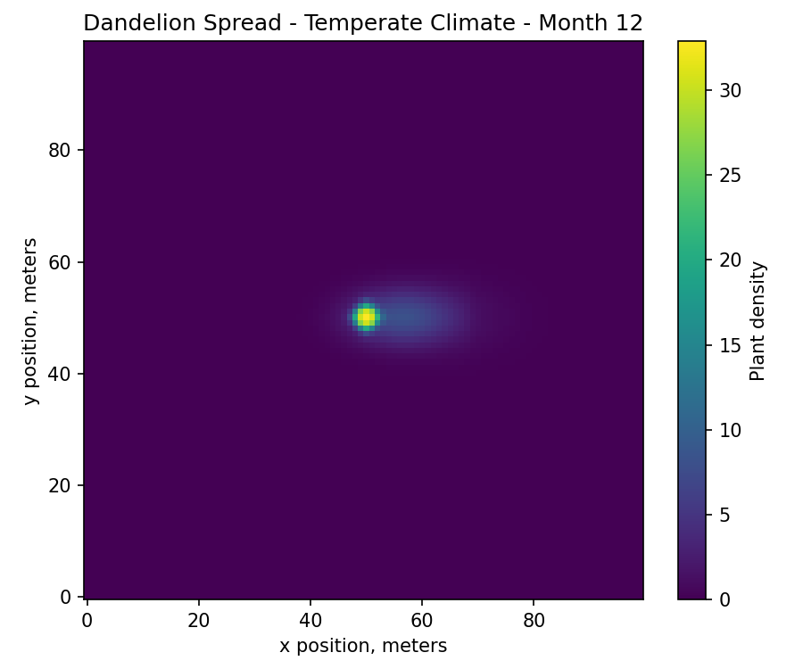

# HiMCM Dandelion Spread Model

This repository is a cleaned reconstruction of my team’s modeling approach for the 2023 HiMCM Problem A, **“Dandelions: Friend? Foe? Both? Neither?”**

The original contest files are not included here. I rebuilt the main modeling idea after the competition: a spatiotemporal model that simulates how dandelions spread across a one-hectare plot under different climate conditions, then uses the simulation output to estimate an invasive-species impact factor.

## What this model tries to do

The problem asked us to model how a single dandelion in the puffball stage could spread across an open plot of land over 1, 2, 3, 6, and 12 months. It also asked for a way to evaluate the impact of dandelions and other invasive plant species.

This reconstruction focuses on two parts:

1. Simulating dandelion spread over time and space.
2. Building a simple impact-factor framework for comparing invasive plants.

## Model idea

The land is represented as a 100 by 100 grid. Each grid cell represents one square meter, so the full grid represents one hectare.

At each monthly step, plant density changes based on:

- biological growth,
- local spatial diffusion,
- wind-based seed dispersal,
- and climate suitability.

A simplified version of the update rule is:

```text
N(t + 1) = N(t)
         + C · r · N(t)(1 - N(t) / K)
         + D · ∇²N(t)
         + W(t)
```

where:

- `N(t)` is plant density at time `t`,
- `C` is the climate suitability factor,
- `r` is the growth rate,
- `K` is the carrying capacity,
- `D · ∇²N(t)` represents local spread,
- `W(t)` represents wind-driven seed dispersal.

## Climate settings

The simulation compares three climate settings:

- temperate,
- arid,
- tropical.

Each climate changes the growth multiplier based on how close the temperature and precipitation are to the plant’s preferred conditions.

## Impact factor

The impact factor is not meant to be a perfect ecological measurement. It is a modeling framework that combines several factors into one score:

- spread area,
- population density,
- climate adaptability,
- dispersal ability,
- ecological harm,
- and human benefit adjustment.

This matches the structure of the HiMCM prompt, which asks us to consider both harmful and beneficial aspects of dandelions.

## Example output

The script generates heatmaps and CSV summaries in the `results/` folder.

### Temperate climate, month 12



### Arid climate, month 12


### Tropical climate, month 12


## Files

- `dandelion_spread_model.py` — reconstructed simulation and impact-factor code
- `requirements.txt` — Python packages used
- `results/` — generated heatmaps and summary CSV files

## Important note

This repository is a reconstruction for presentation and documentation purposes. It is not the original HiMCM submission code or final contest paper.
